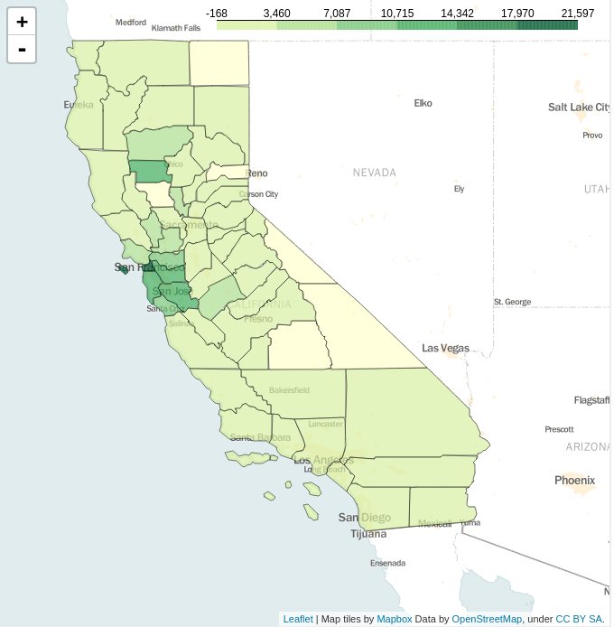

# Analyzing Tweet Data with PostGIS 

*Using PostGIS to load and analyze tweet data  
Civil & Environmental Engineering 263n: Scalable Spatial Analytics at UC-Berkeley, Fall 2016  
By Yiyan Ge, Paul Sohn, Stephen Wong, Ruoying Xu, October 4, 2016*

## Part 1: Tools for Spatial Analysis

First, we compare the features of three programmatic tools for working with spatial data in different ways: Shapely, Fiona, and PostGIS.

### Shapely

Shapely is an open-source Python package that is primarily used for calculations on geospatial data, 
and is built for dealing with specifically geospatial data tasks.
However, most processes in Shapely can be applied to non-spatial data as well.
The simplicity of the algorithm in Shapely allows it to generate results quicker.
Shapely is usually applied to the following cases: 

* Produce and generate geospatial data;
* Perform spatial operations to spatial data, such as spatial join, buffer, union, intersect, etc.;

### Fiona

Fiona is the Python API for OGR, and is primarily aimed at processing regular data with some spatial components.
It has the ability to deal with data with many different formats and types of files, 
and allows users to convert them into OpenGIS Simple Features Reference Implementation (OGR) types that can be used with GDAL libraries. 
But Fiona does not have the ability to perform spatial operations on spatial data.
Fiona is usually applied to the following cases:

* Create, process, edit data tables;
* Project spatial data into different projection systems;

### PostGIS

PostGIS is an open-source database library that is used as a spatial information system.
It can not only perform spatial operations to spatial data (although not as well as Shapely), 
but also allows users to perform high-speed spatial queuing. 
PostGIS is usually applied to the following cases:

* Extending spatial functions (e.g. distance, area, union, and intersections) to PostgreSQL object-relational databases;
* Calculating areas, distances, lengths and perimeters;
* Determining topologies (i.e. the interactions of geometries);
* Making 3D measurements;
* Geocoding of TIGER data (a special use case);
* Processing raster data

## Part 2: Spatial Queries

For this assignment, we set up a PostgreSQL 9.3 installation with PostGIS 2.2 on a Linode server.
To load the Twitter data into PostGIS, we will:

* Load the data in a pandas DataFrame in Python
* Use the pandas `to_sql` method to load the DataFrame into a PostgreSQL table
* Create a PostGIS geometry column in the new table
* Update the geometry column using the `lat` and `lng` columns in the tweets table 

First, we will connect to the PostgreSQL database using sqlalchemy to take advantage of 
the pandas built in "to_sql" method.

```
from sqlalchemy import create_engine
enginestring = 'postgresql://{}:{}@74.207.246.217:5432/tweets'.format(user, password)
engine = create_engine(enginestring)

with pd.HDFStore(os.path.join(os.getcwd(), '..', 'data', 'tweets_1M.h5'), mode='r') as store:
    df = store.tweets_subset

df.to_sql('tweets', engine)
```

From now on, we will use the psycopg2 Python package to connect to the online database:

```
import psycopg2
conn = psycopg2.connect(database=db_name, user=user, password=password, host=host)
cur = conn.cursor()
```

We can check the columns in the loaded table to see if the DataFrame was loaded:

```
cur.execute("SELECT column_name, data_type FROM information_schema.columns \
            WHERE table_name = 'tweets';")
cur.fetchall()
```

Results of the query are as follows:

Column | Data Type
--- | ---
index | bigint
 id | bigint
 lat | double precision
 lng | double precision
 text | text
 timeStamp | timestamp without time zone
 user_id | bigint

The next step is to add a geometry column to turn this regular table into a 
PostGIS spatial table. We can use the `AddGeometryColumn` function for this.
Then we will update the column to generate spatial objects using the 
`ST_SetSRID` and `ST_Point` functions.

```
cur.execute("SELECT AddGeometryColumn ('tweets', 'location', 4326, 'POINT', 2);")
cur.execute("UPDATE tweets SET location = ST_SetSRID(ST_Point(lng, lat), 4326);")
```

A repeated query shows a new column:

Column | Data Type
--- | ---
location | USER-DEFINED

Now that the tweets are loaded into PostGIS as a spatial database, we can insert the county shapefile
downloaded from the Census website. 

```
shp2pgsql -I -W 'latin1' -s 4326 tl_2010_06_county10.shp counties | psql -h 74.207.246.217 -d tweets -U paul
```

We can check a few values of the FIPS codes of counties that were loaded. In addition to below,
we can load the table in QGIS to view the points.

```
cur.execute("SELECT geoid10 FROM counties LIMIT 5;")
cur.fetchall()
---
[('06059',), ('06103',), ('06011',), ('06083',), ('06051',)]
```

The following are demonstrations of some spatial queries. The first one gets the number of tweets inside 
of Contra Costa County which has a FIPS code of 06013. We utilized `ST_Intersects`.
The result shows that there are about 85000 tweets in the county of interest.

```
query = "SELECT count(*) FROM counties, tweets \
         WHERE counties.geoid10='06013' \
         AND ST_Intersects(counties.geom, tweets.location);"

cur.execute(query)
cur.fetchall()
---
[(8502L,)]
```
The second spatial query gets the number of tweets that fall 100 miles outside 
Alameda County (FIPS code = 06001). We utilized `ST_Dwithin` and its negation to get number of features outside the buffer.
Depending on whether the unit of spatial reference system of the data is meter or not, `ST_Transform` may be used to convert unit to meter
for the purpose of distance calculation.

```
query = "SELECT count(*) FROM counties, tweets \
        WHERE counties.geoid10='06001' \
        AND NOT ST_Dwithin(ST_Transform(counties.geom, 3157), ST_Transform(tweets.location, 3157), 160934);"

cur.execute(query)
cur.fetchall()
---
[(14906L,)]
```

Following is an alternative way to get population data into database.

```
# Get the population data for California counties directly from the Census API 

c = Census(secrets.censuskey)

population = c.sf1.get('P0010001', geo={'for': 'county:*',
                                       'in': 'state:06'})
pop = pd.DataFrame(population)
pop.columns = ['population', 'county', 'state']
pop['geoid10'] = pop.state + pop.county
pop.head()
```

population | county | state | geoid10
--- | --- | --- | ---
1510271 | 001 | 06 | 06001
1175 | 003 | 06 | 06003
38091 | 005 | 06 | 06005
220000 | 007 | 06 | 06007
45578 | 009 | 06 | 06009

```
from sqlalchemy import create_engine
enginestring = 'postgresql://{}:{}@74.207.246.217:5432/tweets'.format(user, password)
engine = create_engine(enginestring)
pop.to_sql('population', engine)
conn.commit()
```

Population data is joined to counties and numbers of tweets by counties are summarized and joined to counties
as well. Based on common county name, two tables are further joined and then tweets per capital are calculated.

```
query = """
SELECT 

county_pop.name, 
county_tweets.count_tweets::float/county_pop.pop::float

FROM

    (SELECT counties.name10 as name, population.population as pop, counties.geom as geom 
    FROM population 
    INNER JOIN counties 
    ON counties.geoid10 = population.geoid10) county_pop
    
    INNER JOIN

    (SELECT counties.name10 as name, count(*) as count_tweets 
    FROM tweets, counties
    WHERE ST_Intersects(tweets.location, counties.geom)
    GROUP BY counties.name10) county_tweets

ON county_pop.name = county_tweets.name;

"""

cur.execute(query)
result = cur.fetchall()
```

A bit of post-processing allows us to add counties with no tweets (required for Folium visualization),
and scale the number up to tweets per one million people, for better interpretability:

```
# To visualize with Folium, we need to add counties where there are no tweets.
# Start with getting all the counties from the database.
query = 'SELECT NAME10 FROM counties;'

cur.execute(query)
result = cur.fetchall()
counties = pd.DataFrame(result, columns=['NAME10'])

# Merge into DataFrame
county_tweets = pd.merge(counties, df, how='left')

# Turn into tweets per 1,000,000 people for easier interpretation
county_tweets.tweets_per_capita = county_tweets.tweets_per_capita * 1000000
county_tweets.to_csv(os.path.join(os.getcwd(),'..','data','tweets_per_capita.csv'), index=False)
```

The following tables shows the first several records of the query results.

NAME10 | tweets_per_capita
--- | ---
Orange|246.492629
Tehama|4222.933048
Colusa|NaN
Santa Barbara|179.289683
Mono|NaN
Monterey|1594.961656

County shapefile was first converted to geojson and joned with tweets_per_capita. The `folium.Map` method from the 
Folium python package (a wrapper for Leaflet) is used to visualize the result:

```
county_map = folium.Map(location=[38, -119], zoom_start=6, tiles="Mapbox Bright") 
county_map.choropleth(geo_path=geojson,
    data=pd.read_csv(os.path.join(os.getcwd(),'..','data','tweets_per_capita.csv')),
    columns= ['NAME10', 'tweets_per_capita'], 
    key_on='feature.properties.NAME10',
    fill_color='YlGn',
    fill_opacity=0.7,
    line_opacity=0.2,
    legend_name="Tweets per 1M people")

county_map.save('counties.html')
```

### Number of tweets per 1 million people, by county


## Part 3: MongoDB

We will also explore some of the spatial features of a MongoDB, a more recently popular NoSQL database system, 
using pymongo as a Python wrapper.

### Creating a GeoJSON File
We begin by loading the original database and creating an array.

```
import json
import pandas

with open('tweets_1M.json','r') as f:    
    tweets = json.load(f)  
```

For MongoDB to understand and read the file, we transform the JSON File into a GeoJSON File.

```
tweets_geojson_format3 = [{"type": "Feature", 
                           "location": {"type": "Point", "coordinates": [d["lng"],d["lat"]]}, 
                           "id": d["id"], "text": d["text"],
                           "user_id": d["user_id"]} for d in tweets]
```

We save the GeoJSON file to the disk to be imported later.
```
with open('tweets_geojson_format3.json', 'w') as fp:
    json.dump(tweets_geojson_format3, fp)
```

### Importing the GeoJSON File into MongoDB

To import the file into MongoDB, we write the following into the command prompt:

```
mongoimport --host=127.0.0.1 --port=27017 --db database_3 --collection twitter_3 --type=json --file tweets_geojson_format3.json --jsonArray
```

At the same time, we have to ensure that MongoDB is running at the same time in a command prompt, 
all folders have been created with the correct paths, and that the data has been stored in the correct folder with MongoDB commands. 
We next run some basic commands to extract the database.
```
import pymongo
from pymongo import MongoClient

client = MongoClient()
db = client.database_3
```

Two of the queries are spatial in nature and we create a spatial index for this purpose.
```
#Create a Spatial Index

db.twitter_3.create_index([('location','2dsphere')])
```

### Query all Tweets from 1138308091

```
cursor = db.twitter_3.find({"user_id": 1138308091})
for document in cursor:
    print(document)
```
The query resulted in 3 tweets.  Two are shown here.    
```
{'user_id': 1138308091, 'text': 'According to a study at #UCBerkeley, each #tech #job in SF creates 5 nontech positions. Who am I supporting... Uber? laundry services? Food?', 'type': 'Feature', 'id': 378189982248091648, '_id': ObjectId('57f57cab01cc00c53b3bf50d'), 'location': {'coordinates': [-122.40190047, 37.78914447], 'type': 'Point'}}
{'user_id': 1138308091, 'text': 'That moment your #shazam is #backstreetboys ...', 'type': 'Feature', 'id': 379122191872176128, '_id': ObjectId('57f57cb101cc00c53b3d9194'), 'location': {'coordinates': [-122.46826224, 37.65079252], 'type': 'Point'}}...
```

### Query 10 Tweets Nearest to 378189967014379520

```
cursor = db.twitter_3.find({"id": 378189967014379520})
```
```
for document in cursor:
    print(document)
```
The query resulted with a single tweet with a specific lat/long coordinate to be used for the next code cell.
```
{'user_id': 172710354, 'text': '@DarrenArsenal1 Alexi Lalas', 'type': 'Feature', 'id': 378189967014379520, '_id': ObjectId('57f57cab01cc00c53b3bf50c'), 'location': {'coordinates': [-118.36353256, 34.0971366], 'type': 'Point'}}
```

Note that we input the coordinates from the last response into a new query.
```
cursor = db.twitter_3.aggregate([
{'$geoNear': {
    'near': { 'type': 'Point', 'coordinates': [ -118.36353256, 34.0971366 ] },
    'num': 10,
    'distanceField': 'dist.calculated',
    'spherical': True}}])

for document in cursor:
    print(document)
```
The query resulted in 10 tweets.  Two are shown here.
```    
{'user_id': 172710354, 'dist': {'calculated': 0.0}, 'text': '@DarrenArsenal1 Alexi Lalas', 'type': 'Feature', 'id': 378189967014379520, '_id': ObjectId('57f57cab01cc00c53b3bf50c'), 'location': {'coordinates': [-118.36353256, 34.0971366], 'type': 'Point'}}
{'user_id': 135323671, 'dist': {'calculated': 7.562498675782954}, 'text': '“@nataliablanco83: Coming out soon!!!! #cwh #wellness #cousin #picoftheday @piamiller01 @ rose bay http://t.co/OG7a9mxhyp” #teamFamily 😉', 'type': 'Feature', 'id': 385990165321089024, '_id': ObjectId('57f57cdf01cc00c53b4a5a97'), 'location': {'coordinates': [-118.36360314, 34.09710197], 'type': 'Point'}}...
```

### Query all Tweets within the Polygon

To query successfully, we add the polygon coordinates to the cursor first.
```
cursor = db.twitter_3.find({
     'location': {
     '$geoWithin': {
     '$geometry': {
     'type' : "Polygon" ,
     'coordinates': [[[-122.412,37.810],[-122.412,37.804],[-122.403,37.806],[-122.407,37.810],[-122.412,37.810]]]}}}})

for document in cursor:
    print(document)
```

The query resulted in a large set of tweets, of which two are shown here.

```    
{'user_id': 449285514, 'text': 'Ear cuffs: yay or nay?', 'type': 'Feature', 'id': 386233772888174592, '_id': ObjectId('57f57ce001cc00c53b4ab590'), 'location': {'coordinates': [-122.40376321, 37.80616142], 'type': 'Point'}}
{'user_id': 308850121, 'text': '@ShellieMaitre @jkg1017 thought it would be too scary!', 'type': 'Feature', 'id': 382577182763003904, '_id': ObjectId('57f57cc701cc00c53b43e730'), 'location': {'coordinates': [-122.40423985, 37.80638461], 'type': 'Point'}}...
```